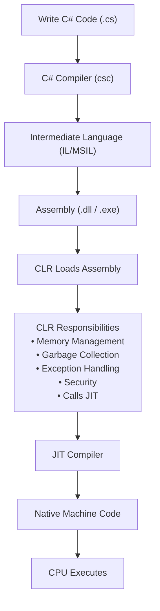

>[!info] `CIL`  Common Intermediate Language

`.NET` framework-based applications that are written in supportive languages like C#, F#, or Visual basic are compiled to Common Intermediate Language (CIL).

Compiled code is stored in the form of an assembly file that has a `.dll` or `.exe` file extension.

>[!info] `CLR (Common Language Runtime)` ≈ JVM

This is the execution engine of .NET. It manages memory, garbage collection, exception handling, security, Thread Management and execution of Intermediate Language (IL) code, similar to how JVM executes Java byteCode.

When the .NET application runs, Common Language Runtime (CLR) takes the assembly file and converts the `CIL` into machine code with the help of the Just In Time (JIT) compiler.

Now, this machine code can execute on the specific architecture of the computer it is running on.

![[Pasted image 20260626114637.png]]


---
>[!question] How does a C# program execute?

When we compile a C# program, the C# compiler first converts the source code into Intermediate Language (IL) and packages it into an assembly, such as an EXE or DLL. 

When the application runs, the CLR loads the assembly and the JIT compiler converts the IL into native machine code, which is then executed by the CPU.




---


>[!important] Application Startup Flow 

When we run :

```bash
dotnet run
```

`Program.cs` Executes
   ↓
Builder Created
   ↓
Services Registered (builder.Services.AddControllers();)
   ↓
Application Built
   ↓
Middleware Pipeline Created
   ↓
Controllers Mapped
   ↓
Kestrel Starts
   ↓
server Listening On Port : 5047


---

**Framework Class Library(FCL):**

It has pre-defined methods and properties to implement common and complex functions that can be used by .NET applications. It will also provide types for dates, strings, numbers, etc.

This class library includes APIs for database connection, file reading and writing, drawing, etc.

