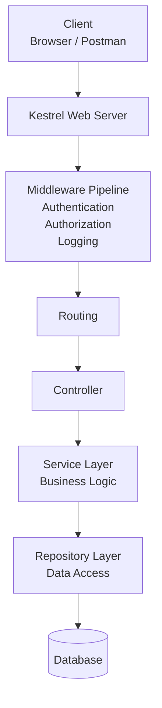

| Spring Boot                  | ASP.NET Core            | What it Does?                                                                                          |
| ---------------------------- | ----------------------- | ------------------------------------------------------------------------------------------------------ |
| Spring Boot                  | ASP.NET Core            |                                                                                                        |
| Java                         | C#                      |                                                                                                        |
| JVM                          | CLR ()                  |                                                                                                        |
| Maven                        | NuGet                   |                                                                                                        |
| application.properties       | appsettings.json        |                                                                                                        |
| @RestController              | [ApiController]         |                                                                                                        |
| @Service                     | Service                 |                                                                                                        |
| @Repository                  | Repository              |                                                                                                        |
| Spring Security              | ASP.NET Authentication  |                                                                                                        |
| Hibernate                    | Entity Framework Core   |                                                                                                        |
| JAR                          | DLL                     |                                                                                                        |
| Tomcat                       | Kestrel                 |                                                                                                        |
| @RequestMapping              | [Route]                 |                                                                                                        |
| @RequestMapping("/products") | [Route("api/products")] |                                                                                                        |
| ResponseEntity               | IActionResult           | represents the result of an HTTP responses such as 200 OK, 404 Not Found, and 400 Bad Request          |
| @RequestBody                 | [FromBody]              |                                                                                                        |
| @PathVariable                | Route Parameter         | Route parameters are values embedded directly in the URL path and used to identify specific resources. |
| @RequestParam                | [FromQuery]             |                                                                                                        |
| @GetMapping                  | [HttpGet]               |                                                                                                        |
| @GetMapping("/{id}")         | [HttpGet("{id}")]       |                                                                                                        |
| @PostMapping                 | [HttpPost]              |                                                                                                        |
| @PutMapping                  | [HttpPost]              |                                                                                                        |
| @DeleteMapping               | [HttpDelete]            |                                                                                                        |
| DTO                          | DTO                     |                                                                                                        |
| @ControllerAdvice            | Exception Middleware    |                                                                                                        |
| Servlet Filter               | Middleware              |                                                                                                        |
| HandlerInterceptor           | Middleware              |                                                                                                        |
| HttpServletRequest           | HttpContext.Request     |                                                                                                        |
| HttpServletResponse          | HttpContext.Response    |                                                                                                        |
|                              |                         |                                                                                                        |

>[!question] Explain the ASP.NET Core request lifecycle.

When client call a API like : `GET /api/products/1` ASP.NET Core processes it like this:




---
### Controller in ASP.NET Core:


```CS
[ApiController]
[Route("api/products")]
public class ProductController : ControllerBase {

    [HttpGet]
    public IActionResult GetProducts() {
        return Ok("Products");
    }
    
    //Route Parameter == @PathVariable
    [HttpGet("{id}")]  
    public IActionResult GetProduct(int id){  
	    return Ok(id);  
    }
    
    // Query Parameters- [FromQuery] == @RequestParam
    [HttpGet]
    public IActionResult GetProducts(
	    [FromQuery] int page,
	    [FromQuery] int pageSize
	    ){
			    return Ok();
		}
    
    //[FromBody] == @RequestBody
    [HttpPost]
    public IActionResult CreateProduct(
		[FromBody]Product product
		){
		    return Ok(product);
    }
    
    //If using DTO. ProductRequest is a DTO class we create
    //[FromBody] is optional here
    [HttpPost]
    public IActionResult CreateProduct(ProductRequest request){
	}
}
```


SpringBoot equivalent :

```Java
@RestController
@RequestMapping("/products")
```

```Java
@GetMapping
public ResponseEntity<String> getProducts() {
    return ResponseEntity.ok("Products");
}
```

```Java
@GetMapping("/{id}")
public Product getProduct(@PathVariable int id){
}
```

`ControllerBase` : It is a base class for API Controllers. It provide helper methods like :
```cs
Ok()
BadRequest()
NotFound()
Created()
```
---


---
### Model Binding

**Entity :**

```cs
public class Product
{
    public int Id { get; set; }
    public string Name { get; set; }
    public decimal Price { get; set; }
    public DateTime CreatedAt { get; set; }
}
```


DTO : Instead of exposing Entity directly we Create DTO. DTO helps is Security, Validation, Versioning & Loose Coupling

```cs
public class ProductRequest
{
    public string Name { get; set; }
    public decimal Price { get; set; }
}
```

Notice in the DTO class we have not expose `CreatedAt` field. This is because we don't want the Client to manipulate this field. 

>[!NOTE] Request DTO vs Response DTO

In real projects we often use two DTO instead of one. Becasue Request and Response often differ.
	1. Request DTO
	2. Response DTO

``` cs
public class CreateProductRequest
{
	[Required]
    public string Name { get; set; }
    
    [Range(1, 100000)]
    public decimal Price { get; set; }
}
```
	
```cs
public class ProductResponse
{
    public int Id { get; set; }
    public string Name { get; set; }
    public decimal Price { get; set; }
}
```
---
>[!NOTE] Mapper :  Maps DTO to Entity

```cs
using ProductManagement.Api.DTOs.Requests;
using ProductManagement.Api.DTOs.Responses;
using ProductManagement.Api.Entities;

namespace ProductManagement.Api.Mappers;

public static class ProductMapper
{
    // CreateProductRequest -> Product
    public static Product ToEntity(
        CreateProductRequest request)
    {
        return new Product
        {
            Name = request.Name,
            Description = request.Description,
            Price = request.Price,
            ImageUrl = request.ImageUrl,
            Stock = request.Stock,
            ExpiryDate = request.ExpiryDate
        };
    }

    // Product -> ProductResponse
    public static ProductResponse ToResponse(
        Product product)
    {
        return new ProductResponse
        {
            Id = product.Id,
            Name = product.Name,
            Description = product.Description,
            Price = product.Price,
            ImageUrl = product.ImageUrl,
            Stock = product.Stock,
            ExpiryDate = product.ExpiryDate
        };
    }

    // Update existing Product from UpdateProductRequest
    public static void UpdateEntity(
        Product product,
        UpdateProductRequest request)
    {
        product.Name = request.Name;
        product.Description = request.Description;
        product.Price = request.Price;
        product.ImageUrl = request.ImageUrl;
        product.Stock = request.Stock;
        product.ExpiryDate = request.ExpiryDate;
    }
}
```

---
## DTO Validation : 

Without validations any bad data can enters your database. A backend should reject invalid requests before they reach the Service layer.

```cs
[Required]
[Required(ErrorMessage =  "Description is required.")]  

[StringLength(500, MinimumLength = 5)]
[StringLength(100, MinimumLength = 3, ErrorMessage = "Name must be between 3 and 100 characters.")]

[Range(0, 10000)]
[Range(0, 100000, ErrorMessage =  "Stock cannot be negative.")]

[EmailAddress]

[RegularExpression(@"^[0-9]{10}$")]
```

[ApiController] : automatically triggers these validation 

```cs
using System.ComponentModel.DataAnnotations;
namespace ProductManagement.Api.DTOs.Requests;

public class CreateProductRequest{

	[Required(ErrorMessage ="Name is required.")]
	[StringLength(100,MinimumLength = 3, ErrorMessage = "Name must be between 3 and 100 characters.")]
	
	public string Name { get; set; } = string.Empty;
	
	[Required(ErrorMessage = "Description is required.")]
	[StringLength(500, MinimumLength = 5)]
	public string Description { get; set; } = string.Empty;
	  
	[Range(1, 1000000, ErrorMessage = "Price must be greater than 0.")]
	public decimal Price { get; set; }
	  	
	[Required]
	public string ImageUrl { get; set; } = string.Empty;
	
	[Range(0,100000, ErrorMessage = "Stock cannot be negative.")]
	public int Stock { get; set; }
	
	[Required]
	public DateOnly ExpiryDate { get; set; }

}
```

---

Understanding `.NET CLI`

```bash
dotnet new
dotnet build
dotnet restore
dotnet run
dotnet clean
dotnet test
```

---
