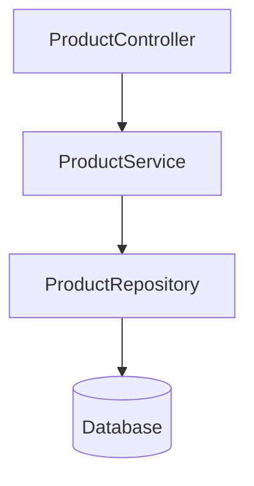

### First: What Problem Does DI Solve?

suppose we have : 



Without DI we have to do inject object manually :

```java
public class ProductController
{
    private ProductService _service = new ProductService();
}
```

Here the ProductController is creating Service, Tight Coupling. 

Now it is difficult if we want to :
	replace service 
	Want to mock service
	Want to unit test


How to do DI in `.NET`

```Java
public class ProductController
{
    private readonly IProductService _service;

    public ProductController(IProductService service){
        _service = service;
    }
}
```

what is this `readonly` ?  
This `readonly` field can only be assigned:
- At declaration
- Inside the constructor
After that, it cannot be changed.

  > [!NOTE] 
  > In springBoot when we use annotations like `@Service`, `@Repository`, `@Component` etc Spring automatically registers the class in the DI Container. We don't manually register it.
  > 
> But in .NET we don't have anything like this, so we  need to manually register it in the `Program.cs

---

>[!question] Explain Service Lifetimes.

ASP.NET Core provides three service lifetimes: 
1. **Transient** : 
- A Transient service creates a new instance every time it is requested. Even inside the **same request**, if it's resolved multiple times, you'll get new instances.
- Suppose one request came : `GET /api/products/1` which required a `ProductService` class. Now DI Container creates ProductService object. Later in the **same request**, another class also needs `ProductService`, DI Container creates ProductService object again. 
- We can use Transient service? Use when the service: Doesn't store state, service is lightweight. Service is independent.

2. **Scoped** : 
- A Scoped service creates one instance per HTTP request and shares it throughout that request.
- Suppose one request came : `GET /api/products/1` which required a `ProductService` class. Now DI Container creates ProductService object. Later in the **same request**, another class also needs `ProductService`, DI Container instead of creating a new one it reused the previously created one. 


3. **Singleton** : 
- A Singleton service creates only one instance for the entire application lifetime and shares it across all requests.
- It is used when  Data doesn't change often, Service is thread-safe, Expensive to create.

```cs
builder.Services.AddScoped<IProductService, ProductService>();

builder.Services.AddTransient<IProductService, ProductService>();

builder.Services.AddSingleton<IProductService, ProductService>();
```

`builder.service` : Register objects in the DI Container. 

`AddScoped` : Register service .Lifetime = Scoped. Scoped = One instance per HTTP request.

`AddTransient` : Every request Create new ProductService, Even within the same HTTP request.

`AddSingleton` : When application Starts Create ProductService object. Reuse forever.

`<IProductService, ProductService>()` : When somebody asks for IProductService Create ProductService Use Scoped Lifetime .


```cs

var builder = WebApplication.CreateBuilder(args);

builder.Services.AddControllers();

builder.Services.AddScoped<IProductService, ProductService>();

builder.Services.AddScoped< IProductRepository,ProductRepository>();

var app = builder.Build();

builder.Services.AddDbContext<AppDbContext>();
```

---
