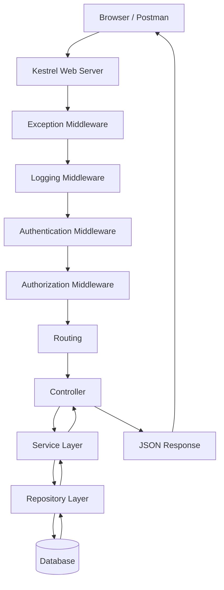
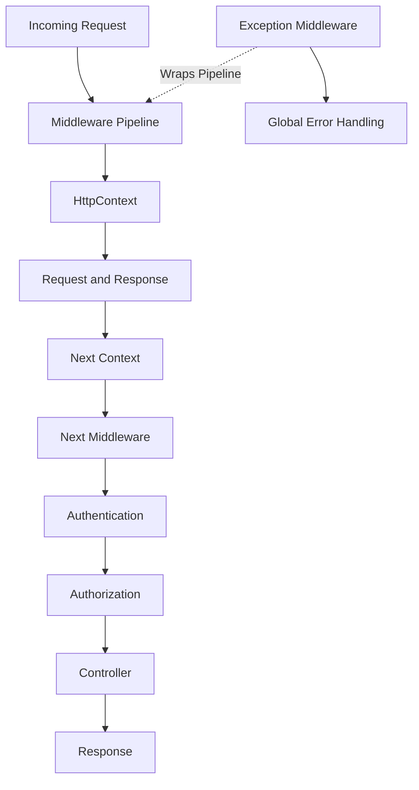

When client sends the request to our .NET application, The request goes like this :




>[!Note] What is Middleware?

> Middleware is a component that sits in the request pipeline and can inspect, modify, continue, or stop a request.

> [!EXAMPLE] Common Middleware :

- ASP.NET Core ships with many built-in middlewares.
- Exception Handling
- Logging
- CORS
- Authentication
- AuthorizationRouting
- HTTPS Redirections

>[!NOTE] Where Middleware Is Configured

inside `Program.cs` we register the Middleware in a particular order. 


>[!info] middleware order matter as middleware executes in the order(top to bottom) it is registered, and incorrect ordering can break application behavior.


> [!DANGER] We can't register in wrong order :

```cs
// Can't do Authorization before UseAuthentication
app.UseAuthorization();
app.UseAuthentication();
```

>[!success] Always follow Correct ordering :

```Cs
app.UseAuthentication();
app.UseAuthorization();
```

---
## Ok now we will learn how we create our own custom middleware :


### Logging middleware - we crate it to handle 

	- Log Requests
	- Log Responses
	- Measure Execution Time
	
```c#
public class LoggingMiddleware
{
    private readonly RequestDelegate _next;

    public LoggingMiddleware(RequestDelegate next){
        _next = next;
    }
}
```

What Is `RequestDelegate` ? it is Reference to next middleware. If we have 

Middleware A
 ↓
Middleware B
 ↓
Middleware C

_next means call next middleware.

---
### InvokeAsync() :Every Middleware has this method to process the request


```c#
public async Task InvokeAsync(HttpContext context){
}
```

```c#

public class LoggingMiddleware
{
    private readonly RequestDelegate _next;

    public LoggingMiddleware(RequestDelegate next){
        _next = next;
    }

    public async Task InvokeAsync(HttpContext context){
        Console.WriteLine("Before Request");

// It passes control to the next middleware in the request pipeline.
        await _next(context);

        Console.WriteLine("After Request");
    }
}
```

```
Before Request
Controller Executes
After Request
```

>[!QUEsTION] Why we write `await _next(context)` ?

without it the request never reaches controller and the Pipeline stops.

`await _next(context)` passes the control to the next middleware in the request pipeline.

---

>[!INFO] Exception Middleware

>Global Exception Handling in ASP.NET Core is handled using the Global Exception Middleware 
>
>Exception Middleware centralizes exception handling and provides consistent error responses across the application.  


```cs
public class ExceptionMiddleware { 
	private readonly RequestDelegate _next;

    public ExceptionMiddleware(RequestDelegate next){
        _next = next;
    }

    public async Task InvokeAsync(HttpContext context) {
        try {
        
        //Continue next request pipeline
	    await _next(context);
        }
        catch(Exception ex){
            await HandleException(context, ex);
        }
    }
}
```

## Register Custom Middleware

Inside `Program.cs` we register it, so that every request passes through it.


```c#
app.UseMiddleware<LoggingMiddleware>();


app.UseMiddleware<ExceptionMiddleware>();
```

>[!Example] Built-In Middleware Examples

```Cs

app.UseMiddleware<ExceptionMiddleware>();

//HTTPS - It Redirect HTTP to HTTPS.
app.UseHttpsRedirection();

//Authentication : It identifies user.
app.UseAuthentication();

//Authorization : It Checks permissions.
app.UseAuthorization();

// Routing : It maps URL to controller.
app.MapControllers();

```


- HttpContext : 
	- HttpContext represents the current HTTP request, response, user, and related metadata. 
	- Every middleware receives : `HttpContext context` .  

```cs
// Request + Response + User
HttpContext context

//Request data.
context.Request

//Response data.
context.Response

//Authenticated user
context.User
```

---





